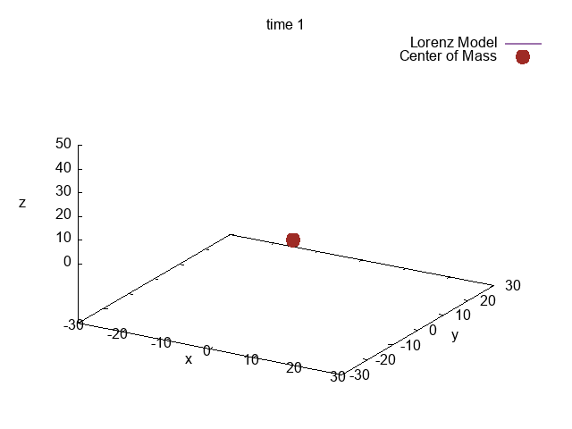

## Final Project - Numerical Modeling


This code base is for my numerical modeling final. The current plan is to work with the Lorenz Equations (also known as the Lorenz 63 Model). The code here will solve the Lorenz system, then create a simple Kalman filter to assimilate at first random data. It might incorporate real data at one point, but then we'll try an Ensemble system to see if we can aggregate results over a wider set of values.

Currently, we just have the Lorenz Model as shown above in the gif.

Current directory: 
```
.
├── .gitignore
├── .vscode
│   ├── c_cpp_properties.json
│   ├── settings.json
│   └── tasks.json
├── CMakeLists.txt
├── README.md
├── build.sh
├── inc
│   ├── lorenz_ensemble.hpp
│   └── lorenz_solver.hpp
├── lorenzplot.gnu
└── src
    ├── lorenz_ensemble.cpp
    ├── lorenz_solver.cpp
    └── main.cpp

4 directories, 13 files
```
Note: ./build.sh must be given run permissions with `chmod +x ./build.sh` before running it. The CMakeLists.txt was copied from a previous project so will be updated as we move and update dependencies.